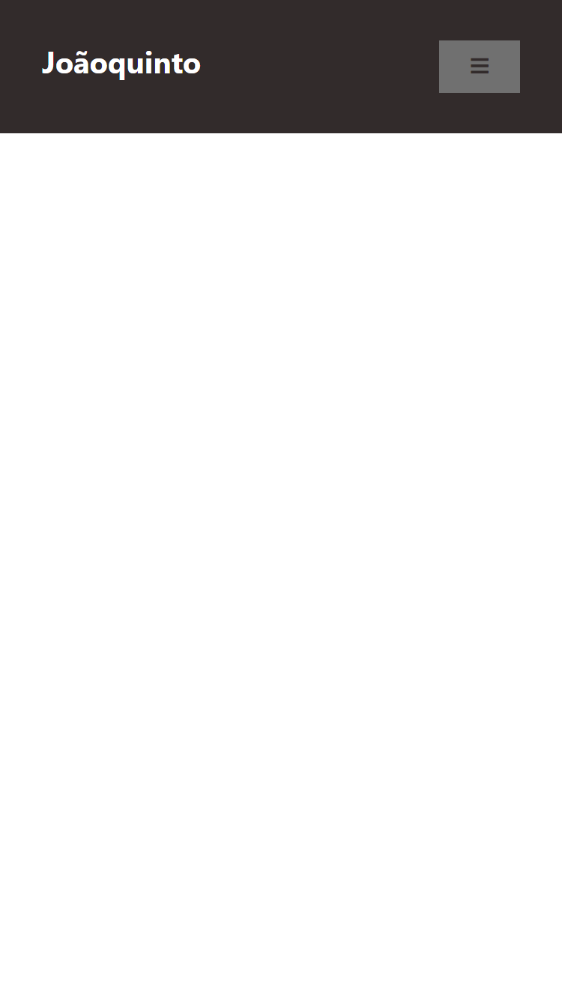
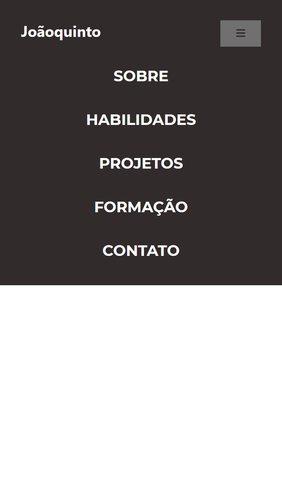
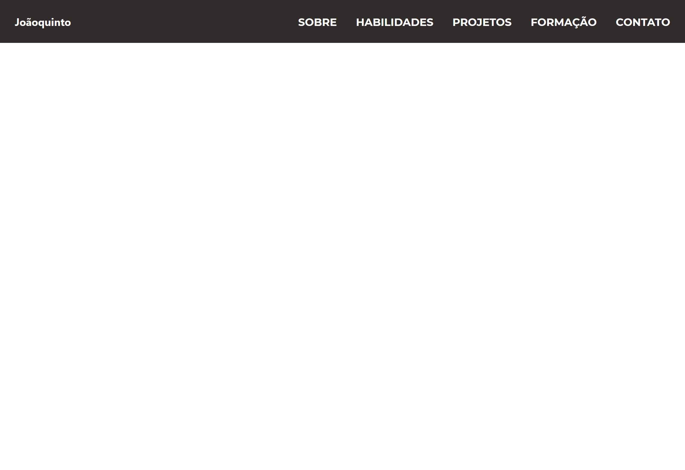

#Joãoquinto-portfolio

Olá esse é o repositório do meu portfólio de projeto!

## Autores

- [@joaoquinto](https://github.com/joaoquinto)

## Aprendizados

O que você aprendeu construindo esse projeto? Quais desafios você enfrentou e como você superou-os?

## Stack utilizada

**Front-end:** HTML5, CSS3, Javascript, Google Fonts

**Icons:** Font Awesome

**Plugins:**

**Design:** AdobeXD

**Monitoramento:** Google Analytics

## Screenshots

### Mobile Screenshot

### Desktop Screenshot

## Licença

[MIT](https://github.com/joaoquinto/joaoquinto-portfolio/blob/main/LICENSE)
