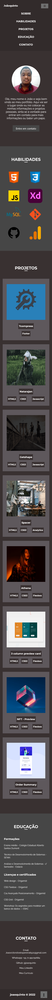
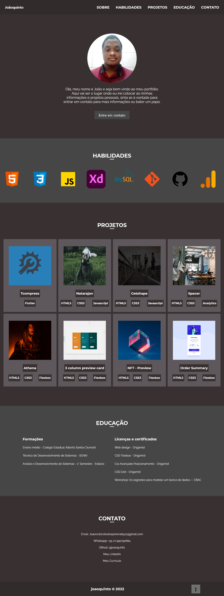

# joaoquinto-portfolio

Olá esse é o repositório do meu portfólio de projeto!

## Autores

- [@joaoquinto](https://github.com/joaoquinto)

## Stack utilizada

**Front-end:** HTML5, CSS3, Javascript

**Ferramentas:** Google Fonts, AdobeXD, Compressor.io, CSS Compressor, Vscode, Git, Github, Google Lighthouse

**Icons:** Font Awesome

**Plugin:** Vlibras

**Monitoramento:** Google Analytics

## Screenshots

### Mobile Screenshot

### Desktop Screenshot

## Licença

[MIT](https://github.com/joaoquinto/joaoquinto-portfolio/blob/main/LICENSE)
